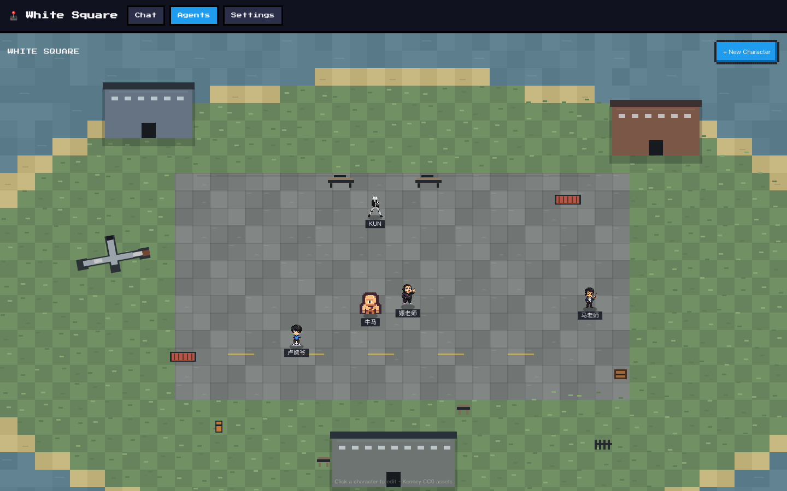

# White Square

White Square is a local-first pixel plaza for creating snapshot-defined AI agents and chatting with them in groups.

Instead of writing custom agent code for every character, you define an **Agent Snapshot**: identity, model/runtime settings, sprite, catchphrases, skills, and memory behavior. The host runtime can then spawn that snapshot into a runnable agent.

The project is experimental and currently focused on a local MVP.

<p align="center">
  
</p>

## Features

- **Snapshot-defined agents**: create a new agent by editing metadata, not by writing a new runtime.
- **Editable identity**: define the character's background, voice, behavior boundaries, and interaction style in `identity.md`.
- **Pixel plaza UI**: agents appear as sprites, move around, and speak catchphrases when they get close.
- **Multi-agent group chat**: add multiple agents to the same session and talk to them together.
- **Broadcast and mention routing**: send one message to all included agents, or use `@name` to target one agent.
- **Readable broadcast turns**: agents receive the same prompt in parallel, while the UI keeps replies separated by speaker so group chat does not collapse into noise.
- **Per-agent memory**: runtime memory is split into `session` and `global` scopes.
- **Provider-flexible runtime**: the built-in pi runtime supports multiple LLM providers, with echo mode when no key is configured.

## Quick Start

Requirements:

- Node.js 22+
- npm

Install dependencies and start the local host + UI:

```bash
npm install
npm run dev
```

Open:

```text
http://localhost:5173
```

The dev command starts:

- host API / websocket server on `http://localhost:4319`
- Vite UI on `http://localhost:5173`

If no LLM key is configured, White Square runs in **echo mode**, so the UI and group-chat flow can still be tested locally.

## Configure Models

You can configure keys in either place:

- UI: open **Settings**, paste the provider key, and save.
- Environment variable: start the app with the relevant key in the shell.

UI-saved keys are stored in `./.data/secrets.json`, ignored by git, and override environment variables.

| Provider | Models | Environment variable |
|---|---|---|
| Claude (Anthropic) | Sonnet 4.6 / Opus 4.8 / Haiku 4.5 | `ANTHROPIC_API_KEY` |
| GPT (OpenAI) | GPT-5.1 / GPT-5 Pro / GPT-4o | `OPENAI_API_KEY` |
| GLM (Z.ai / 智谱) | GLM-5.2 / 5.1 / 4.7 | `ZAI_API_KEY` |
| DeepSeek | V4 Pro / V4 Flash | `DEEPSEEK_API_KEY` |
| Vercel AI Gateway | routes to supported models | `AI_GATEWAY_API_KEY` |

Example:

```bash
ANTHROPIC_API_KEY=sk-ant-... npm run dev
```

## How To Use

1. Open the **Agents** tab.
2. Create a new profile or edit an existing Agent Snapshot.
3. Set the identity, model/runtime, sprite, and catchphrases.
4. Open the **Chat** tab and create a session.
5. Add agents from the right sidebar.
6. Send a normal message to broadcast to all included agents, or use `@name` to target one.

The default local profiles include 卢姥爷, KUN, 马老师, and 嫖老师. They are stylized internet-persona agents for the White Square playground, not real-person replicas.

## Agent Snapshot

An Agent Snapshot is the portable definition of an agent.

Current snapshot fields include:

- `id`, `name`, `description`: profile identity and display metadata.
- `identityMd`: the character prompt, written as Markdown.
- `runtime`, `model`: which runtime and model should run the agent.
- `sprite`: the plaza character image.
- `catchphrases`: short lines the agent can say in the plaza.
- `skills`: optional capability metadata for future tool extensions.

Runtime memory is not embedded as static prompt text. Agents access memory through tools:

- `session`: facts, decisions, preferences, and context that matter inside the current chat session.
- `global`: stable facts and preferences that should carry across future sessions for this character.

## Plaza

White Square uses the metaphor of a public square instead of a plain chat window.

The design direction combines two ideas:

- a renaissance-square feeling of shared public space, where characters visibly gather and interact;
- the internet absurdity of “卢本伟广场”, where stylized meme-personas, livestream language, and group-chat chaos can coexist.

The goal is not just a themed skin. The plaza makes agents feel present: they have a body, a position, a local social context, and lightweight ambient behavior before they ever enter a chat session.

## Group Chat

A chat session can include multiple agents.

Routing rules:

- **Broadcast**: if the user does not mention a specific agent, every included agent receives the same message in the same turn.
- **Mention**: if the user writes `@name`, only the targeted agent responds.
- **Shared transcript**: agents can see the group conversation history.
- **Separate state**: each agent keeps its own conversation state and memory.
- **Speaker-separated UI**: responses are rendered as distinct bubbles with agent names, so the user can scan who said what.

Broadcast turns are designed to behave like a group room without becoming noisy. The user writes once; the host fans that message out to the included agents from the same transcript state; each agent answers in its own voice and memory scope; the UI keeps those replies visually separated. That makes a multi-agent turn feel like a room responding, not a sequential chain where one agent's output immediately derails the next.

## Architecture

The repository is split into four workspaces:

```text
packages/core      shared snapshot types, model metadata, prompt helpers
packages/runtime   pluggable AgentRuntime implementations
packages/host      local storage, API server, websocket orchestration
packages/ui        React + Vite pixel plaza and chat UI
```

The default runtime uses [`@earendil-works/pi-agent-core`](https://github.com/earendil-works/pi) and `pi-ai` for model providers. The runtime boundary is intentionally explicit so other engines can be added later.

Local data is stored in:

```text
.data/
```

Deleting `.data/` resets local snapshots, sessions, memory, and saved secrets.

## Project Status

Current MVP scope:

- local pixel plaza UI
- editable Agent Snapshots
- multi-agent chat sessions
- broadcast and `@mention` routing
- session/global runtime memory
- local model-provider settings

Out of scope for the current MVP:

- hosted sandbox execution
- web publishing / share links
- complex autonomous multi-agent orchestration
- remote account system

## Documentation

- [Design document](docs/design.md)
- [Technical design](docs/tech-design.md)

## Assets

Pixel assets come from [Kenney](https://kenney.nl) under CC0:

- `Tiny Town`: town tiles
- `Tiny Dungeon`: character sprites

License files are included under `packages/ui/public/assets/*/License.txt`.

## License

MIT
